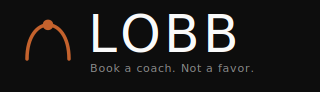

<p align="center">
  
</p>

<p align="center">
  <strong>Private LOBB product repository for the tennis coaching marketplace.</strong>
</p>

<p align="center">
  
  
  
  
  
  
  
</p>

---

## Internal Overview

LOBB is the MVP foundation for a Lagos tennis coaching marketplace. It supports the full player flow, coach operations workspace, and admin review tools in one Next.js application.

This repository is private. Treat the codebase, product copy, route map, brand assets, and operating notes as internal LOBB material.

Product promise:

> Book a coach. Not a favor.

## Mobile Web Strategy

LOBB is intentionally a mobile-optimized web app for the MVP. App store downloads are a conversion barrier; a browser-first product works on every Lagos phone with zero install friction. Native iOS/Android should wait until at least 100 completed bookings prove the core loop.

## What Is Included

| Area | Routes | Purpose |
| --- | --- | --- |
| Public | `/`, `/coaches`, `/coaches/[slug]` | Landing page, coach discovery, public coach profile |
| Auth | `/auth/login`, `/auth/verify`, `/auth/role`, `/auth/setup/player`, `/auth/setup/coach/1` | OTP login, role selection, onboarding |
| Booking | `/book/[coachSlug]/step-1`, `/book/[coachSlug]/step-2`, `/book/[coachSlug]/step-3`, `/book/confirm` | Slot confirmation, session details, payment summary, success state |
| Player | `/dashboard`, `/dashboard/bookings/[id]`, `/dashboard/review/[bookingId]`, `/profile` | My bookings, booking detail, reviews, profile |
| Coach | `/coach/dashboard`, `/coach/bookings`, `/coach/bookings/[id]`, `/coach/earnings`, `/coach/profile`, `/coach/availability`, `/coach/profile/preview` | Coach home, schedule, earnings, profile editor, availability |
| Admin | `/admin`, `/admin/coaches`, `/admin/bookings`, `/admin/disputes` | Platform dashboard, coach approvals, booking log, disputes |
| Utility/Sub-screens | `/profile/edit`, `/coach/create-profile`, `/admin/earnings` | Implementation helpers for edit and finance workflows |
| Support/Legal | `/how-it-works`, `/faq`, `/terms`, `/privacy` | MVP support and legal pages |

## MVP Screen Inventory

The counted MVP scope is **27 distinct screens plus 8 overlay/modal states**. Utility routes and support/legal pages help the implementation, but they do not change the MVP screen count.

### Onboarding & Auth (Shared)

| ID | Screen | Route |
| --- | --- | --- |
| 1.1 | Splash / Hero | `/` |
| 1.2 | Phone Entry | `/auth/login` |
| 1.3 | OTP Verification | `/auth/verify` |
| 1.4 | Role Selection | `/auth/role` |
| 1.5a | Player Quick Setup | `/auth/setup/player` |
| 1.5b | Coach Name Setup (Step 1) | `/auth/setup/coach/1` |

### Player

| ID | Screen | Route |
| --- | --- | --- |
| 2.1 | Home | `/` |
| 2.2 | Browse / Search | `/coaches` |
| 2.3 | Coach Profile with About, Availability, Reviews tabs | `/coaches/[slug]` |
| 2.4 | Booking Step 1: Select Slot | `/book/[coachSlug]/step-1` |
| 2.5 | Booking Step 2: Session Details | `/book/[coachSlug]/step-2` |
| 2.6 | Booking Step 3: Payment | `/book/[coachSlug]/step-3` |
| 2.7 | Booking Confirmation | `/book/confirm` |
| 2.8 | My Bookings with Upcoming and Past tabs | `/dashboard` |
| 2.9 | Booking Detail with Cancel flow | `/dashboard/bookings/[id]` |
| 2.10 | Leave a Review | `/dashboard/review/[bookingId]` |
| 2.11 | Player Profile / Settings | `/profile` |

### Coach

| ID | Screen | Route |
| --- | --- | --- |
| 3.1 | Coach Dashboard Home | `/coach/dashboard` |
| 3.2 | Coach Bookings List | `/coach/bookings` |
| 3.3 | Coach Earnings | `/coach/earnings` |
| 3.4 | Coach Profile Editor with section sub-flows | `/coach/profile` |
| 3.5 | Availability Manager | `/coach/availability` |
| 3.6 | Profile Preview | `/coach/profile/preview` |

### Admin

| ID | Screen | Route |
| --- | --- | --- |
| 4.1 | Admin Dashboard | `/admin` |
| 4.2 | Coach Approval Queue | `/admin/coaches` |
| 4.3 | All Bookings | `/admin/bookings` |
| 4.4 | Dispute Resolution | `/admin/disputes` |

### Global / Utility States

| State | Where It Appears |
| --- | --- |
| Toast system | Global app shell |
| Empty states | Every list screen that can be empty |
| Skeleton loaders | Data-fetching screens |
| Offline state | Global app shell |
| Cancellation confirmation modal | Player booking detail |
| Filter bottom sheet | Browse / Search |
| Sort bottom sheet | Browse / Search |
| Coach rejection modal | Admin coach approvals |

### Helper Routes Outside The Count

| Route | Reason |
| --- | --- |
| `/profile/edit` | Player profile edit sub-screen for 2.11 |
| `/coach/create-profile` | Coach profile section editor for 3.4 |
| `/admin/earnings` | Admin finance utility linked from platform operations |
| `/how-it-works`, `/faq`, `/terms`, `/privacy` | Support and legal content |

## Navigation Map

```txt
SPLASH
  -> Phone Entry -> OTP -> Role Selection
        |-> Player Setup -> HOME (Player)
        |     |-> Browse <-> Coach Profile -> Book Step 1 -> Step 2 -> Step 3 -> Confirmation
        |     |-> My Bookings -> Booking Detail -> Cancel modal
        |     |                              -> Leave Review
        |     `-> Player Profile
        |
        `-> Coach Setup -> COACH DASHBOARD
              |-> Coach Bookings
              |-> Coach Earnings
              |-> Coach Profile Editor -> Profile Preview
              `-> Availability Manager

ADMIN (separate login through the same phone OTP, role = admin)
  -> Admin Dashboard -> Coach Approvals -> Reject modal
                     -> All Bookings
                     -> Dispute Resolution
```

## Core Product Behaviors

- OTP-first onboarding with a default development test OTP.
- Role-aware navigation for players, coaches, and admins.
- Protected workspaces through middleware route guards.
- Booking funnel from coach profile to confirmation.
- Player booking hub with upcoming, past, detail, and review states.
- Coach dashboard with bookings, earnings, profile completion, and availability tools.
- Admin dashboard with approval queue, booking log, dispute resolution, and earnings overview.
- Brand kit with logos, favicons, verified badge, design preview, and design-system documentation.

## Design System

The canonical design-system reference lives here:

```txt
brand-kit/design.md
```

The rendered visual preview lives here:

```txt
brand-kit/brand-preview.html
```

Open the preview on Windows:

```powershell
Start-Process .\brand-kit\brand-preview.html
```

Primary tokens:

| Token | Hex | Use |
| --- | --- | --- |
| `--lobb-black` | `#0D0D0D` | Primary text, dark cards, active nav, high-confidence actions |
| `--lobb-clay` | `#C4622D` | Primary CTA, active state, booking emphasis |
| `--lobb-bg` | `#F2F1EF` | Warm app background and section grounding |
| `--lobb-surface` | `#FAFAFA` | Cards, forms, operational panels |
| `--lobb-muted` | `#8A8A8A` | Secondary copy and helper text |
| `--lobb-success` | `#2D6A4F` | Confirmed, approved, success |
| `--lobb-star` | `#F4A228` | Ratings and review stars |

Design rule of thumb: LOBB should feel premium and operational, not decorative. Dense information is okay when hierarchy, spacing, and controls remain calm.

## Brand Kit

```txt
brand-kit/
  design.md                 Internal design-system specification
  brand-preview.html         Rendered design-system preview
  logos/                     Marks, wordmarks, full logo lockups
  badges/                    LOBB verified badge
  favicons/                  Favicon source files
```

Use the logo lockup for product and documentation headers:

```txt
brand-kit/logos/lobb-logo-with-tagline.svg
```

Use the mark for icons and compact placements:

```txt
brand-kit/logos/lobb-mark.svg
```

## Tech Stack

- Next.js App Router
- React 18
- TypeScript
- Tailwind CSS
- shadcn/base UI primitives
- Supabase Auth and database-ready helpers
- Paystack-ready payment screens
- Termii/Twilio-ready OTP messaging layer
- Lucide icons

## Local Setup

Install dependencies:

```bash
npm install
```

Create local environment values:

```powershell
Copy-Item .env.example .env.local
```

Run the app:

```bash
npm run dev
```

Open:

```txt
http://localhost:3000
```

## Development OTP

Default test OTP:

```txt
000000
```

Relevant environment controls:

```env
LOBB_TEST_OTP=000000
NEXT_PUBLIC_LOBB_TEST_OTP=000000
LOBB_ENABLE_TEST_OTP=
```

Production disables the test OTP unless it is explicitly enabled.

## Environment Variables

Use `.env.example` as the source of truth.

Required groups:

- `NEXT_PUBLIC_SUPABASE_URL`
- `NEXT_PUBLIC_SUPABASE_ANON_KEY`
- `SUPABASE_SERVICE_ROLE_KEY`
- `PAYSTACK_PUBLIC_KEY`
- `PAYSTACK_SECRET_KEY`
- `PAYSTACK_WEBHOOK_SECRET`
- `TERMII_API_KEY`
- `TERMII_SENDER_ID`
- `RESEND_API_KEY`
- `NEXT_PUBLIC_APP_URL`
- `NEXT_PUBLIC_APP_NAME`
- `ADMIN_SECRET`

Optional compatibility variables:

- `NEXT_PUBLIC_SUPABASE_PUBLISHABLE_KEY`
- `SMS_PROVIDER`
- `TWILIO_*`

Never commit `.env.local`. It is ignored by `.gitignore`.

## Data Model Mapping

Supabase Auth owns credentials and sessions. The product spec's `users` model is represented by `public.profiles`, with a compatibility view at `public.users`.

The product spec's `coach_profiles` model is represented by `public.coaches`, with a compatibility view at `public.coach_profiles`.

Canonical implementation tables:

- `profiles`: phone, email, full name, role, avatar, active state.
- `coaches`: slug, headline, bio, rate, locations, specializations, languages, certifications, court access, video, Paystack subaccount, bank details, review status, verified badge.
- `players`: player-specific profile fields.
- `bookings`, `payments`, `reviews`, `coach_availability`, `coach_availability_blocks`: marketplace workflow data.

## Scheduled Notifications

Configure a cron runner to call these endpoints with `x-admin-secret: $ADMIN_SECRET`:

```bash
curl -X POST "$NEXT_PUBLIC_APP_URL/api/notifications/schedule-booking-jobs" -H "x-admin-secret: $ADMIN_SECRET"
curl -X POST "$NEXT_PUBLIC_APP_URL/api/notifications/process-due" -H "x-admin-secret: $ADMIN_SECRET"
```

Recommended cadence:

- Schedule booking jobs every 15 minutes.
- Process due SMS jobs every 5 minutes.

## Quality Gates

Production build:

```bash
npm run build
```

Lint:

```bash
npm run lint
```

Current verified status:

```txt
npm run build: passing
```

## Route Protection

Middleware behavior:

- Unauthenticated users are redirected to `/auth/login?next=...`.
- Safe deep links are preserved through OTP verification.
- Coach routes require the `coach` role.
- Admin routes require the `admin` role.
- Coach users are routed to `/coach/dashboard`.
- Player users are routed to player surfaces.

## Repository Structure

```txt
src/
  app/                 App Router pages and route handlers
  components/          UI shells, navigation, cards, primitives
  lib/                 Auth helpers, mock data, Supabase clients, SMS helpers
brand-kit/             Brand system, SVG assets, rendered preview
supabase/              Database migration artifacts
```

## Root Directory Contract

The root should stay intentionally small.

| Path | Keep? | Reason |
| --- | --- | --- |
| `src/` | Yes | Application routes, components, and runtime helpers |
| `public/` | Yes | Public runtime assets such as `favicon.svg` |
| `brand-kit/` | Yes | Internal brand assets, preview, and design-system docs |
| `supabase/` | Yes | Database migrations and project artifacts |
| `.env.example` | Yes | Safe environment template |
| `.env.local` | Local only | Developer secrets, ignored by Git |
| `package.json` / `package-lock.json` | Yes | Dependency contract |
| `tailwind.config.ts`, `tsconfig.json`, `next.config.mjs`, `postcss.config.mjs` | Yes | Framework configuration |
| `.editorconfig`, `.gitattributes`, `.gitignore` | Yes | Repo hygiene and cross-machine consistency |
| `.next/`, `node_modules/`, `.agents/`, `skills-lock.json` | No | Local/generated/tooling artifacts; ignored |

## Production Readiness Notes

- Rotate any keys that have ever lived outside the secret manager.
- Replace MVP legal text before public launch.
- Move mock booking/admin data to Supabase queries behind RLS policies.
- Connect Paystack callbacks before accepting real payments.
- Wire coach approvals, cancellations, payouts, and disputes to persistent tables.
- Add CI for build, lint, and type checks before expanding the team.

## Access And Ownership

This is a private LOBB repository. Do not redistribute the code, brand assets, designs, route map, or product notes outside approved LOBB collaborators.

## License

Private. All rights reserved.
