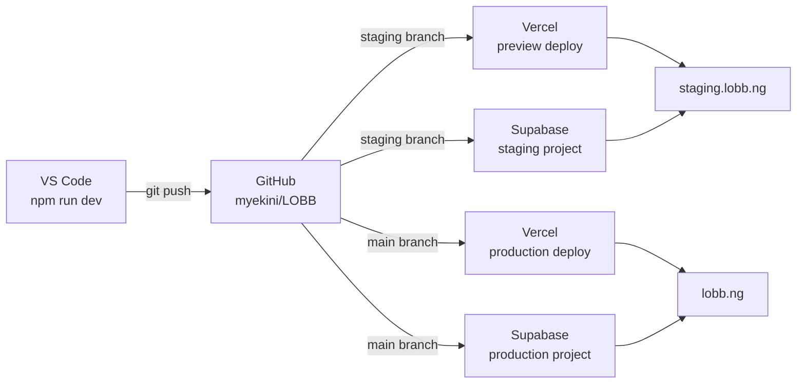

<p align="center">
  
</p>

<p align="center">
  <strong>LOBB: A tennis coaching marketplace MVP for Lagos. Book a coach. Not a favor.</strong>
</p>

<p align="center">
  
  
  
  
  
  
</p>

---

## Overview

**LOBB** is a mobile-first tennis coaching marketplace MVP built for Lagos. It streamlines the connection between tennis players seeking lessons and certified coaches offering their expertise.

**Core Promise:** Book a coach. Not a favor.

The platform supports three distinct user flows:
- **Players**: Discover coaches, book sessions, manage bookings, and leave reviews
- **Coaches**: Manage availability, track earnings, build profiles, and view bookings
- **Admins**: Approve coaches, monitor bookings, and resolve disputes

## Why LOBB?

LOBB is intentionally a **mobile-optimized web app** for the MVP. Browser-first eliminates the conversion barrier of app store downloads—every Lagos phone with internet can access coaching services instantly, with zero friction.

## What's Inside

**27 core screens + 8 modal states** organized across four experience layers:

| Layer | Routes | Purpose |
| --- | --- | --- |
| **Public** | `/`, `/coaches`, `/coaches/[slug]` | Landing, coach discovery, public profiles |
| **Auth** | `/auth/login`, `/auth/verify`, `/auth/role`, `/auth/setup/*` | OTP onboarding, role selection, setup flows |
| **Booking** | `/book/[coachSlug]/step-1/2/3`, `/book/confirm` | Multi-step booking funnel with payment |
| **Player** | `/dashboard`, `/dashboard/bookings/*`, `/profile` | My bookings, booking details, reviews, settings |
| **Coach** | `/coach/dashboard`, `/coach/bookings`, `/coach/earnings`, `/coach/availability`, `/coach/profile` | Coach operations workspace |
| **Admin** | `/admin`, `/admin/coaches`, `/admin/bookings`, `/admin/disputes` | Platform oversight and moderation |

## Tech Stack

- **Frontend**: Next.js 14.2 (App Router), React 18, TypeScript, Tailwind CSS
- **UI**: shadcn/base primitives, Lucide icons
- **Backend/Auth**: Supabase Auth + PostgreSQL
- **Payments**: Paystack-ready (screens included)
- **Notifications**: Twilio WhatsApp OTP, Resend for email
- **Hosting**: Vercel (live at [lobb-alpha.vercel.app](https://lobb-alpha.vercel.app))

## Language Composition

- JavaScript: 58.7%
- TypeScript: 35.7%
- PLpgSQL: 3% (Database migrations)
- HTML: 1.7%
- CSS: 0.9%

## Quick Start

```bash
npm install
cp .env.example .env.local
npm run dev
```

Open [http://localhost:3000](http://localhost:3000)  
Test OTP: `000000`

## Design System

Premium and operational aesthetics with a warm, accessible color palette:

| Token | Hex | Use |
| --- | --- | --- |
| `--lobb-black` | `#0D0D0D` | Primary text, dark cards, active nav |
| `--lobb-clay` | `#C4622D` | Primary CTA, active states, booking emphasis |
| `--lobb-bg` | `#F2F1EF` | Warm app background |
| `--lobb-surface` | `#FAFAFA` | Cards, forms, panels |
| `--lobb-muted` | `#8A8A8A` | Secondary copy, hints |
| `--lobb-success` | `#2D6A4F` | Confirmed, approved states |
| `--lobb-star` | `#F4A228` | Ratings and reviews |

See `docs/DESIGN.md` and `brand-kit/brand-preview.html` for the canonical design documentation and visual preview.

## Repository Structure

```
src/
  app/          Pages, route handlers, middleware
  components/   UI shells, cards, primitives
  lib/          Auth, helpers, Supabase clients
brand-kit/      Logos, badges, design docs
supabase/       Database migrations
```

## Architecture: Code to Court

Two Supabase projects, two Vercel environments, one repo — a change only reaches real users after it's proven itself on staging first.

| | Local | Staging | Production |
| --- | --- | --- | --- |
| Branch | *(any, `npm run dev`)* | `staging` | `main` |
| Vercel | — | Preview deployment | Production deployment |
| Supabase project | `zvqkofnkjdgxlbtbwhct` (staging) | `zvqkofnkjdgxlbtbwhct` | `nnzddpvhldwjvhxbrrgh` |
| Live URL | `localhost:3000` | `staging.lobb.ng` | `lobb.ng` |
| Who it's for | you, right now | the team, before launch | coaches &amp; players |


```mermaid
flowchart LR
    Dev[VS Code<br/>npm run dev] -->|git push| GH[GitHub<br/>myekini/LOBB]

    GH -->|staging branch| VS[Vercel<br/>preview deploy]
    GH -->|staging branch| SS[Supabase<br/>staging project]
    GH -->|main branch| VP[Vercel<br/>production deploy]
    GH -->|main branch| SP[Supabase<br/>production project]

    VS --> LS[staging.lobb.ng]
    SS --> LS
    VP --> LP[lobb.ng]
    SP --> LP
```

Local dev points at the **staging** project (`.env.local`) — never production — so nothing you run on your own machine can touch real bookings. Migrations in `supabase/migrations/` are applied per branch (`db-migrate.yml`, or the Supabase GitHub integration once linked); `staging` requires the `Quality` check (typecheck/lint/build) to pass before merge, `main` doesn't gate on a review.

## Production Readiness

Before launch:
- [ ] Rotate secrets stored outside the manager
- [ ] Replace MVP legal text (/terms, /privacy)
- [ ] Connect Paystack webhook callbacks
- [ ] Wire admin approvals and payout flows to persistent tables
- [x] Add CI pipeline (lint, type-check, build)

## Access & License

**Private repository.** Code, brand assets, designs, and product notes are for LOBB collaborators only.

All rights reserved.

---

**Need help?** Check `.env.example` for environment setup or review `brand-kit/` for design guidance.
